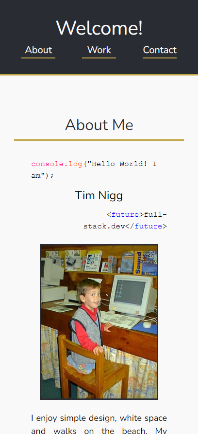
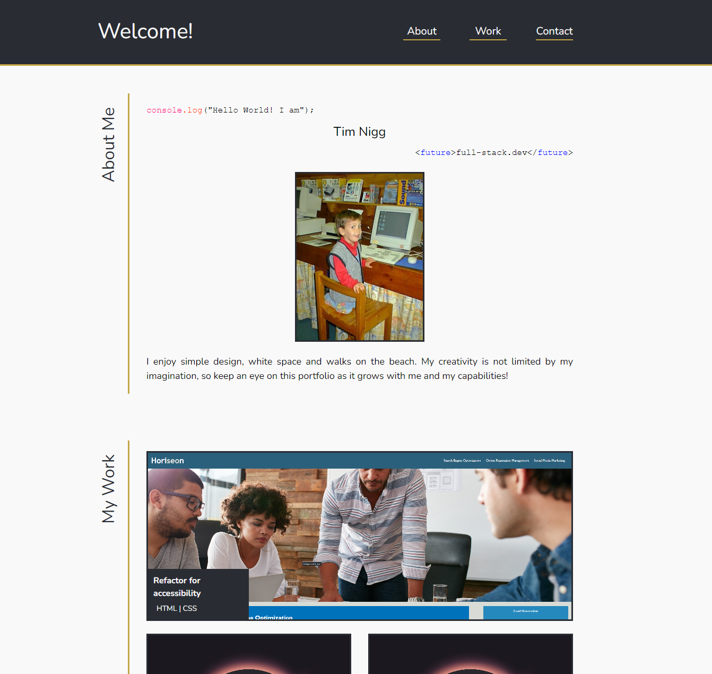

# My Portfolio 
(```my-portfolio``` - Module 2 Challenge)

## Description

- The goal of this project was to create a first version of my portfolio to introduce myself and to showcase a growing collection of my work, with links that take you to that work.
- This was achieved by building a basic webpage from scracth  using HTML and CSS.
- Code was written semantically where possible, and the styling was designed mobile-first and to be responsive (with a breakpoint for larger screens) in order to facilitate accessibility and usability.
- A Contact me section was included, with a form and links to my socials, so that people can get in touch with me.
- This is just the first version of the portfolio and the styling, interactivity and funcionality will develop over time.

### Mobile Appearance:


### Desktop Appearance:



## Installation/Usage

- Please visit the deployed page at: <a href="https://trnigg.github.io/my-portfolio/">trnigg.github.io/my-portfolio/</a> 
- It is a mobile-first design that is responsive across devices from 360px width to larger.
- To view any of my projects displayed within the portfolio, clicking on them will open the corresponding project in a new browser/tab.
- PLEASE NOTE: The current "Contact Me" form has no functionality.

## Credits

- Place holder <a href="https://www.freepik.com/free-vector/coming-soon-text-abstract-sunrise-dark-background-with-motion-effect_24504365.htm#query=coming%20soon&position=4&from_view=keyword&track=ais">image by rorozoa</a> on Freepik (Free License).

## License

MIT License.

Please refer to the license section in the repo for further information.
